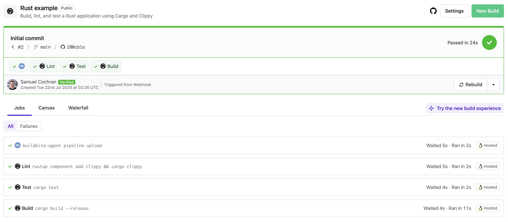

# Buildkite Rust Example

This repository is an example [Buildkite](https://buildkite.com/) pipeline to build, lint, and test a [Rust] application using [Cargo] and [Clippy] using [Docker].

👉 **See this example in action:** [buildkite/rust-example](https://buildkite.com/buildkite/rust-example/builds/latest)

See the full [Getting Started Guide](https://buildkite.com/docs/guides/getting-started) for step-by-step instructions on how to get this running, or try it yourself:

  [Rust]: https://www.rust-lang.org/
  [Cargo]: https://doc.rust-lang.org/cargo/
  [Clippy]: https://doc.rust-lang.org/clippy/
  [Docker]: https://docker.com/

<!-- docs:start -->
## How it works

1. Lints the Rust code with Clippy.
2. Runs tests with Cargo.
3. Compiles and uploads a Rust binary as a [build artifact](https://buildkite.com/docs/pipelines/artifacts).
<!-- docs:end -->

## License

See [LICENSE](LICENSE) (MIT)
